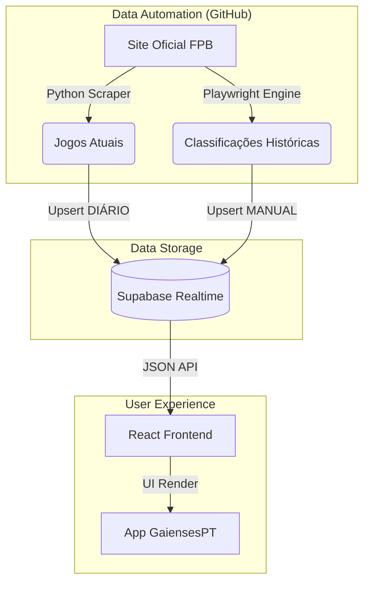

# GaiensesPT

  

**[gaiensespt.vercel.app](https://gaiensespt.vercel.app)**

---

## 🏀 Sobre o Projeto

O **GaiensesPT** nasce da paixão pelo **FC Gaia**.

Num mundo onde a informação desportiva local está dispersa, eu (**mefrraz**) senti a necessidade de criar algo que unisse a comunidade. O objetivo era simples: ter **tudo num só sítio**.

Como adepto e atleta, queria saber quando e onde jogam as nossas equipas sem ter de navegar por sites complexos. Como programador, vi a oportunidade de usar a tecnologia para resolver este problema real.

### 🌟 Funcionalidades para o Adepto
*   **Agenda Digital:** Sabe sempre quando é o próximo jogo.
*   **Resultados ao Vivo:** Acompanha o placard quase em tempo real ao fim de semana.
*   **Histórico de Épocas:** Viaja no tempo e consulta classificações de épocas passadas (2022-2025).
*   **GPS Integrado:** Um clique e o Waze leva-te direto ao pavilhão.
*   **Instalação Fácil:** Funciona como uma App no teu telemóvel (PWA).

---

## 🛠 Bastidores (Área Técnica)

> "Como é que um projeto destes se constrói do zero?"

Este projeto é um exemplo prático de como transformar uma necessidade numa solução escalável, utilizando uma stack moderna e 100% gratuita.

### 🏗 Arquitetura do Sistema

O sistema opera numa arquitetura **Headless**, separando completamente a "inteligência" de dados (Scrapers) da visualização (Frontend).



### 🧠 Como a Magia Acontece

#### 1. Ingestão de Dados (Scraping Inteligente)
Em vez de depender de entradas manuais propensas a erro, o sistema vai buscar a informação à fonte.
*   **Python (BeautifulSoup):** Para dados leves e rápidos (jogos da época).
*   **Node.js (Playwright):** Para simular um navegador e extrair tabelas de classificação complexas que requerem interação (dropdowns, seleção de fases) de épocas passadas.

#### 2. Automação Estratégica
Para garantir dados frescos sem custos de servidor, utilizo **GitHub Actions** com um agendamento inteligente que respeita os limites do "Free Tier":
*   **Dias Úteis:** Atualiza 3x por dia (manhã, tarde, noite).
*   **Fim de Semana (Game Time):** Aumenta a frequência para cada **30 minutos** (Sexta à noite, Sábado e Domingo), garantindo que os resultados aparecem assim que o jogo acaba.

#### 3. Frontend Reativo
A interface foi desenhada em **React** com **TailwindCSS** para ser leve e instantânea. A integração com o **Supabase** permite que, se eu alterar um resultado manualmente na base de dados, a app atualize no telemóvel de todos os utilizadores em milissegundos.

### 📚 Tech Stack
*   **Core:** React, Vite, TypeScript
*   **Styling:** TailwindCSS, Lucide Icons
*   **Backend as a Service:** Supabase (PostgreSQL)
*   **Automation:** GitHub Actions (Cron Jobs)
*   **Scrapers:** Python 3.10, Node.js 18

---

## 🚀 Como Correr Localmente

Se quiseres explorar o código ou contribuir:

```bash
# 1. Clonar o projeto
git clone https://github.com/mefrraz/gaiensespt.git

# 2. Instalar dependências Frontend
cd web
npm install

# 3. Configurar Variáveis
cp .env.example .env

# 4. Iniciar App
npm run dev
```

---

## Créditos
Desenvolvido com ❤️ por **mefrraz** para a família FC Gaia.
*Este projeto não tem afiliação oficial com o clube ou federação.*
