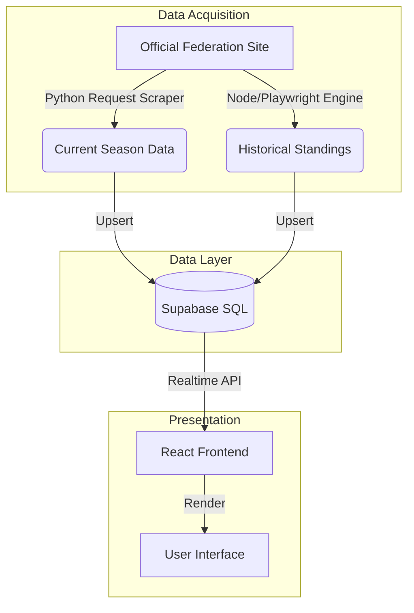

# GaiensesPT

  

**[gaiensespt.vercel.app](https://gaiensespt.vercel.app)**

GaiensesPT is a centralized web platform designed to aggregate and display real-time results, schedules, and standings for FC Gaia Basketball teams. It serves as a unified digital hub for fans, athletes, and club members.

---

## System Architecture

The project operates on a **headless architecture**, separating the frontend presentation from the data acquisition layer.

### 1. Data Ingestion Layer

The scraping strategy employs a **hybrid approach** to balance performance with capability:

*   **Current Season (Python)**: Utilizes `BeautifulSoup` and `Requests` for lightweight, high-frequency polling. This scraper targets the FPB agenda and results pages, parsing server-side rendered HTML to extract match details (time, venue, score). It is optimized for speed and low resource consumption during live matchdays.
*   **Historical Data (Node.js/Playwright)**: Utilizes a headless browser engine to handle client-side rendered Standings tables. This scraper interacts with the dynamic `select` dropdowns for different competition phases, extracting deep historical records that are otherwise inaccessible via simple HTTP requests.

### 2. Automation & Scheduling (CI/CD)

Data reliability is maintained through **GitHub Actions**, which orchestrate the scraping jobs based on specific temporal patterns:

*   **Weekday Routine (Mon-Thu)**: Executes 3 times daily to capture schedule changes or midweek games.
*   **Matchday High-Frequency (Fri-Sun)**: Scales up to 30-minute intervals during prime game windows (Friday evenings and weekends) to ensure near-real-time score updates.
*   **Resource Management**: The schedule is tightly optimized to stay within approximately 40% of the GitHub Actions free tier quota (~800 minutes/month), preventing service interruption.

### 3. Frontend Application

The user interface is built with **React** and **TypeScript**, emphasizing:
*   **Responsive Design**: Mobile-first approach using TailwindCSS.
*   **PWA Standards**: Service workers enable installation on native devices.
*   **Performance**: Static generation with dynamic data fetching on the client side.

---

## Technical Stack

| Component | Technology | Description |
|-----------|------------|-------------|
| **Frontend** | React, Vite | Core application framework |
| **Styling** | TailwindCSS | Utility-first CSS framework |
| **Database** | Supabase (PostgreSQL) | Relational data storage |
| **Scraper A** | Python 3.10 | Static content parser |
| **Scraper B** | Playwright (Node.js) | Dynamic content crawler |
| **CI/CD** | GitHub Actions | Automated workflow orchestration |

---

## Project Structure

*   **/scrapers**: Contains the data extraction logic.
    *   `scrape_games.py`: The high-frequency script for current match data.
    *   `scrape_history.js`: The complex script for multi-phase historical data.
*   **/web**: The source code for the frontend application.
*   **/database**: SQL migration files and schema definitions.
*   **/.github**: Workflow configuration files defining the automation schedules.

---

## Disclaimer

This project is an independent community initiative. It is not officially affiliated with, endorsed by, or connected to FC Gaia or the Portuguese Basketball Federation (FPB).
